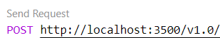

# Binding demo

The purpose of this demo is to show the use of [binding components](https://docs.dapr.io/developing-applications/building-blocks/bindings/) locally and in the cloud.

Open the _demo_binding.code-workspace_ file and click the **Open Workspace** button in the lower right corner. This will reload your Codespace and scope your **Explorer** to just the folders needed for this demo.

To provision the infrastructure before the demo execute the following command in the terminal. 

```
./demo.ps1 -env azure -deployOnly
```

This code is automatically run by the _demo.ps1_ script if the `-env azure` parameter is passed and *./components/azure/local_secrets.json* file is not found.

The workspace consists of one top level folder _Binding_. This folder contains the _components_, _deploy_, and _tempfiles_ folders. The _components_ folder contains an _azure_ and _local_ folder so you can show the difference between a local component and a component configured for the cloud. The component in the _components/azure_ folder is configured to use [Azure Blob Storage](https://docs.dapr.io/reference/components-reference/supported-bindings/blobstorage/). In the _components/aws_ folder the component is configured to use AWS S3 and the local component is configured to use local file storage. The point to make comparing the files is that as long as the name of the component (in our demo "files") does not change the code will work no matter what backing service is used.

The core of the demo is in the _sampleRequests.http_ file. **Do not change this file.** To run the demos use the _demo.ps1_ file. It will update the _sampleRequests.http_ for running locally or in the cloud for you. At the top of the file are three _demo.ps1_ commands. One for running the requests against local resources and two for running against the cloud resources. Copy the desired command and run it in the terminal. This will start Dapr pointing to the appropriate components for the demo. The Dapr run command issued is output if you want to explain during the demo.

Running local
```
./demo.ps1
```

Running in Azure
```
./demo.ps1 -env azure
```

Running in AWS
```
./demo.ps1 -env aws
```

Click the Send Request button above each of the requests to execute them.

 

When running locally you can expand the _tempfiles_ folder to show the data being stored and deleted. When running in the cloud use the portal to show the data being stored and deleted.

When you are done with the demo you can clean up the cloud resources by running the _cleanUp.ps1_ script using the following commands:

```
./cleanUp.ps1
```