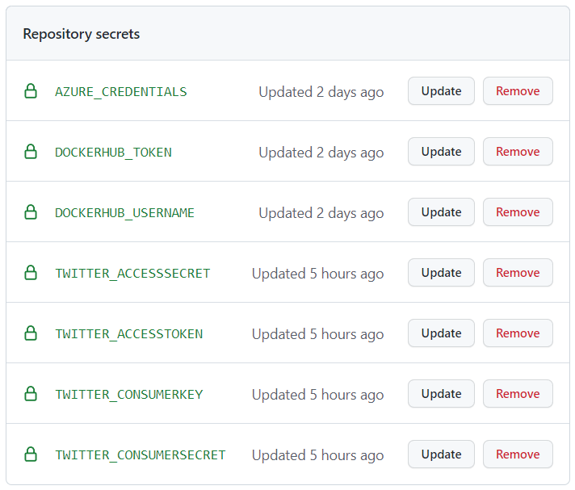
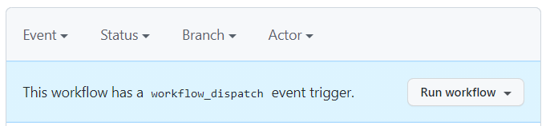

# DevOps demo

The purpose of this demo is to show:
- how to deploy a Daprized application to a cloud based Kubernetes Service, using the [Dapr tool installer](https://github.com/marketplace/actions/dapr-tool-installer) GitHub Action
- using Dapr with C#, Java, JavaScript, and Python
- how to debug all three microservices at the same time across languages

Open the _demo_devops.code-workspace_ file and click the **Open Workspace** button in the lower right corner. This will reload your Codespace and scope your Explorer to just the folders needed for this demo. 

To provision the infrastructure before the demo execute the following command in the terminal. This code is automatically run by the _demo.ps1_ script if the `-env` parameter is passed and *./components/local/local_secrets.json* file is not found.

```
./demo.ps1 -deployOnly
``` 

The project is deployed to Kubernetes using Helm. Each service defines its own chart which is referenced in the Helm Chart defined in the top level _charts_ folder. When deployed to Kubernetes only the C# version of the services are deployed.

## Set Actions secrets

For the GitHub Actions workflow to succeed you must configure the following secrets. These are **not** the CodeSpaces secrets you set earlier. These are set as _Repository secrets_. Review [Configure Azure credentials as GitHub Secret](https://github.com/marketplace/actions/azure-cli-action#configure-azure-credentials-as-github-secret) to set your **AZURE_CREDENTIALS** secret. 



Running this demo will deploy the application to a Kubernetes cluster or run locally using [Project Tye](https://github.com/dotnet/tye). To show the demo running use the _PORTS_ tab to Open port **5000** with running local or **k3d-Demo (30000)** when running with k8s in a browser.

## Running local
```
./demo.ps1 -env K8s
```

## Running in cloud

From the GitHub repo navigate to the Actions tab and use the **Run workflow** button to trigger the workflow. This will deploy all the required infrastructure into Azure and deploy the app.



## Debugging

The _Multi_ launch configuration builds and runs the Java Viewer, Python Provider and CSharp Processor. You can set breakpoints in all three projects and debug all three at the same time.

## Clean Up
When you are done with the demo you can clean up the cloud resources by running the _cleanUp.ps1_ script using the following commands: 

```
./cleanUp.ps1
```