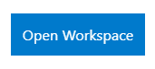
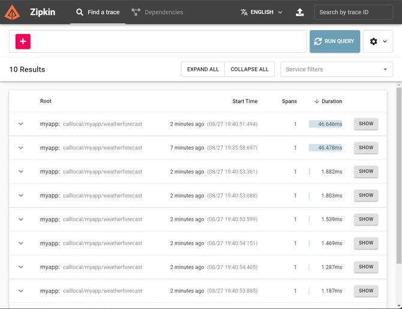
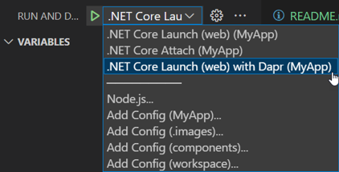

# MyApp demo

The purpose of this demo is to show how to add Dapr to a new .Net app and debug it.

Open the _demo_myapp.code-workspace_ file and click the **Open Workspace** button in the lower right corner.



This will reload your Codespace and scope your Explorer to just the folders needed for this demo. 

To provision the infrastructure before the demo execute the following command in the terminal.

```
./demo.ps1 -deployOnly
```

Running local
```
dapr run --app-id myapp --app-port 5000 --dapr-http-port 3500 -- dotnet run --urls http://*:5000
```

## Steps

### Coding

All the commands below will be performed in a PowerShell terminal. Some of the commands require [Trackyon.Utils](https://www.powershellgallery.com/packages/Trackyon.Utils/0.2.1)

From the root of the workspace create and change into _src/myapp_:

```powershell
mcd src/myapp
```

Now in the folder create a new web API project:

```powershell
dotnet new webapi --no-https
```

At this point we can use Dapr with this app without changing a single line.

```powershell
dapr run --app-id myapp --app-port 5000 --dapr-http-port 3500 -- dotnet run --urls http://*:5000
```

The application can be accessed at [http://localhost:3500/v1.0/invoke/myapp/method/weatherforecast](http://localhost:3500/v1.0/invoke/myapp/method/weatherforecast). Using Dapr to call the web service frees any clients from having to locate and secure communications to the service. To call another service or any component using Dapr simply target _localhost:3500_.

However, the application can still be accessed at [http://localhost:5000/weatherforecast](http://localhost:5000/weatherforecast). This show the incremental adoption of Dapr. The service could start to use Dapr before existing clients are ready to migrate because the service is accessible via the orginal and Dapr addresses.

One of the benefits of using the Dapr address is you get observability for free. Visiting [Zipkin](http://127.0.0.1:9411/zipkin/) and clicking _Run Query_ will show the calls made via Dapr.



In the terminal press Ctrl + C to stop the application. Next add the Dapr package to the project.

```powershell
dotnet add package dapr.aspnetcore
```

This step is optional because all the Dapr functionality can be accessed via HTTP or gRPC requests. However, adding the package will make working with Dapr even easier.

Open _Program.cs_. Update the call to _AddControllers_ by adding _AddDapr_ after it.

```csharp
builder.Services.AddControllers().AddDapr();
```

This update enables dependency injection of the DaprClient class. 

Next, after the call to _UseAuthorization_ add _UseCloudEvents_.

```csharp
app.UseCloudEvents();
```

This adds middleware to unwrap Cloud Events used with Pub/Sub.

Finally add a call to _MapSubscribeHandler_.

```csharp
app.MapSubscribeHandler();
```

This allows code to subscribe to events via attributes.  With those three changes in place we can turn this code into a stateful, event driven service.

By default this code returns random weather data. But a real system might return data stored from events posted to it about the current weather. So we are going to update the data model to have a location property and add code that get executed for each event and stores the data.

Open the _WeatherForecast.cs_ file and add.

```csharp
public string? Location { get; set; }
```

Open the _WeatherForecastController.cs_ file and add.

```csharp
[HttpPost]
[Dapr.Topic("pubsub", "new")]
public async Task<ActionResult<WeatherForecast>> PostWeatherForecast(WeatherForecast model, [FromServices] Dapr.Client.DaprClient daprClient)
{
    await daprClient.SaveStateAsync<WeatherForecast>("statestore", model.Location, model);

    return model;
}
```

Update the _Get_ method to return a single WeatherForecast object. 

```csharp
[HttpGet(Name = "GetWeatherForecast")]
[Route("{location}")]
public async Task<WeatherForecast> Get(string location, [FromServices] Dapr.Client.DaprClient daprClient)
{
    return await daprClient.GetStateAsync<WeatherForecast>("statestore", location);
}
```

### Debugging

With our code complete let's setup debugging of our Dapr application. Bring up the command palette (Press Ctrl + Shift + P on Windows and Linux, Cmd + Shift + P on Mac, or just press F1 on all platforms). Run the _.NET: Generate Assets for Build and Debug_ command. This will create a _launch.json_ and _tasks.json_ file.

Next we need to execute the _Dapr: Scaffold Dapr Tasks_ command. Select _.NET Core Launch (web)_ for the first prompt. Set the Dapr Id to _myapp_ and finally enter 5000 for the port.

Select _Run and Debug_ from the Activity Bar then select _.NET Core Launch (web) with Dapr (MyApp)_.



Now open the _launch.json_ file by clicking the gear icon to the right of the dropdown. Local the _.NET Core Launch (web) with Dapr (MyApp)_ section of the file and delete the _serverReadyAction_ and _sourceFileMap_ objects. This will prevent a browser being open each time we debug our service.

Local the _env_ object and add.

```json
"ASPNETCORE_URLS": "http://localhost:5000"
```

This will make sure our service starts on port 5000.

Notice the _preLaunchTask_ and _postDebugTask_ that start and stop Dapr and our application for us. 

Open _tasks.json_ and locate the _dapr-debug_ section. Under the _appPort_ add:

```json
"httpPort": 3500,
"grpcPort": 50001,
```

This will make sure Dapr is listening for request on port 3500 for HTTP request and 50001 for gRPC requests.

With all the files updated from the _Run_ menu select _Start Debugging_. As the code starts up open _WeatherForecastController.cs_ and set a breakpoint in PostWeatherForecast and Get methods.

Finally, open _sampleRequests.http_. Click _Send Request_ above the POST request. This will post an event to the pubsub component and the first break point will be hit. Press the _Continue_ button in the debug toolbar to continue execution. This will save the weather forecast to the state store.

```
HTTP/1.1 204 No Content
Server: fasthttp
Date: Sun, 28 Aug 2022 23:41:07 GMT
Traceparent: 00-2f68a523e7142f460091cb0130793223-39ce8522c9953e35-01
Connection: close
```

Return to _sampleRequests.http_ and click _Send Request_ above the GET request. The second break will be hit. Press the _Continue_ button in the debug toolbar to continue execution. This will read the previously saved weather forecast from the state store and return it. 

```
HTTP/1.1 200 OK
Server: Kestrel
Date: Sun, 28 Aug 2022 23:40:10 GMT
Content-Type: application/json; charset=utf-8
Content-Length: 85
Traceparent: 00-7def0499fe51d72e18f10cde11a306d3-cfe09fcf61f01ed5-01
Connection: close

[
  {
    "date": "0001-01-01T00:00:00",
    "temperatureC": 46,
    "temperatureF": 114,
    "summary": "hot",
    "location": "77379"
  }
]
```

Press the _Stop_ button on the debug toolbar or select _Stop Debugging_ from the _Run_ menu to stop debugging.

Running in Azure
```
dapr run --app-id azure --dapr-http-port 3500 --components-path ./components/azure
```

Running in AWS
```
dapr run --app-id aws --dapr-http-port 3500 --components-path ./components/aws
```

When you are done with the demo you can clean up the cloud resources by running the _cleanUp.ps1_ script using the following commands: 

```
./cleanUp.ps1
```