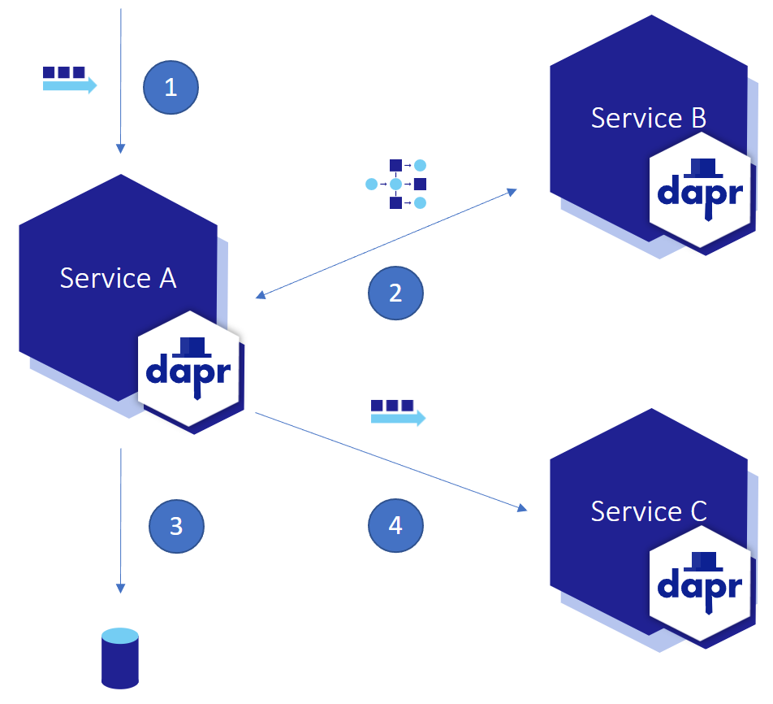

# Observability demo

The purpose of this demo is to show the configuration of [observability](https://docs.dapr.io/developing-applications/building-blocks/observability/) locally and in the cloud.

Open the _demo_observability.code-workspace_ file and click the **Open Workspace** button in the lower right corner.


This will reload your Codespace and scope your Explorer to just the folders needed for this demo.

To provision the infrastructure before the demo execute the following command in the terminal.

```
./demo.ps1 -deployOnly
```

This code is automatically run by the _demo.ps1_ script if the `-env` parameter is passed and *./azureConfig/otel-local-config.yaml* file is missing the Azure Application Insights instrumentation key.

The workspace consists of one top level folder _Observability_. This folder holds the _azureConfig_, _deploy_, and _src_ folders. The _azureConfig_ folder holds the _otel-local-config.yaml_ file that contains the configuration for the [Open Telemetry Collector used to send the data to Application Insights](https://docs.dapr.io/operations/monitoring/tracing/open-telemetry-collector-appinsights/). The Open Telemetry Collector is run in a local container.

The core of the demo is in the _src_ folder. This folder holds three services, Service A, B, and C. Service A subscribes to the **PubSub** component. When a new order is received (1) Service A calls Service B using service to service invocation (2). When Service A gets a response from Service B, Service A stores the processed order using the **StateStore** component (3). Finally, Service A publishes the order to the **PubSub** component where Service C reads it (4).



To start this demo open the _sampleRequests.http_ file. At the top of the file are two _demo.ps1_ commands. One for running the requests with a local configuration and one for running with the cloud configuration. Copy the desired command and run it in the terminal. This will start all three services with the appropriate configuration for the demo. The Dapr run commands issued are output if you want to explain during the demo.

Running local
```
 ./demo.ps1
```

Running in cloud
```
 ./demo.ps1 -env azure
```

Click the Send Request button above of the request to post a new order to Service A to start the demo. After clicking the link a few times you can view the tracing information. If running locally click the

When running locally you can expand the _tempfiles_ folder to show the data being stored and deleted.

When you are done with the demo you can clean up the cloud resources by running the _cleanUp.ps1_ script using the following commands:

```
./cleanUp.ps1
```