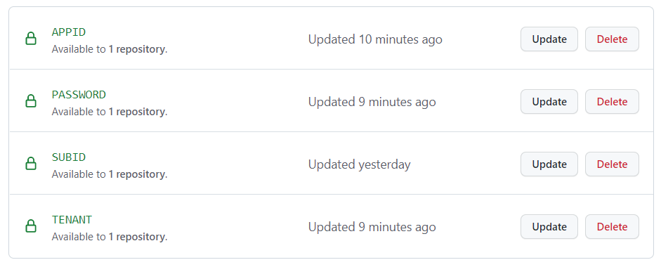

# My Dapr Demos

This repo is a collection of demos of the [Dapr](https://dapr.io) building blocks. Each demo provides a local and cloud based configuration to demonstrate the ability to run on multiple platforms. They are self contained and automatically provision the required infrastructure using the provided Bicep/Terraform files.

Demo | Building Blocks | Local | Azure | AWS | Language
--- | --- | --- | --- | --- | ---:
[Binding](./Binding) | [Bindings](https://docs.dapr.io/developing-applications/building-blocks/bindings/) | File Share | Azure Storage | Amazon S3 | HTTP
[Observability](./Observability) | [Observability](https://docs.dapr.io/developing-applications/building-blocks/observability/) | Zipkin | Azure Application Insights | | C#, HTTP
[PubSub](./PubSub) | [Publish & Subscribe](https://docs.dapr.io/developing-applications/building-blocks/pubsub/) <br> [Publish & Subscribe](https://docs.dapr.io/developing-applications/building-blocks/pubsub/) <br> [State management](https://docs.dapr.io/developing-applications/building-blocks/state-management/) | Redis <br>Redis <br> Redis | Azure Service Bus <br> Azure Event Hubs <br> Azure SQL Server | Amazon SNS <br> Amazon SQS <br> Amazon DynamoDB | C#, HTTP
[Secrets](./Secrets) | [Secrets management](https://docs.dapr.io/developing-applications/building-blocks/secrets/) | Local | Azure Key Vault | | HTTP
[StateStore](./StateStore) | [State management](https://docs.dapr.io/developing-applications/building-blocks/state-management/) | Redis | Azure Cosmos DB | Amazon DynamoDB | HTTP
[DevOps](./DevOps) | [Bindings](https://docs.dapr.io/developing-applications/building-blocks/bindings/) <br> [Observability](./Observability) <br> [PubSub](./PubSub) <br> [State management](https://docs.dapr.io/developing-applications/building-blocks/state-management/) | Twitter <br> Zipkin <br> Redis <br> Redis |  Twitter <br> Zipkin <br> Azure Service Bus <br> Azure Storage | | C#

## Usage

These demos require [CodeSpaces](https://github.com/features/codespaces). This repo is configured to create a CodeSpace with all the required tools. Simply fork this repo and setup the Codespace secrets and assign them to your fork.

## Create Codespace Secrets

To create the Codespace secrets you will need an Azure service principal, tenant and subscription id to run Azure Demos. To run the demos with AWS you will need an AWS access key ID, secret access key and region.

### Azure

All of the demos define components that use Azure infrastructure. To run those demos you must set the appropriate secrets to access Azure resources. If these secrets are not set the Azure infrastructure will not be provisioned.

#### Create Service Principal

When the Codespace is created it runs a script to log in to the Azure CLI. It uses a service principal and needs the appid, password and tenant all of which are returned when you create a service principal. You can use an existing service principal or create a new one using the command below. You can learn more on the [Create an Azure service principal with the Azure CLI](https://docs.microsoft.com/en-us/cli/azure/create-an-azure-service-principal-azure-cli) page.

```
az ad sp create-for-rbac --name DaprServicePrincipal

{
  "appId": "00000000-0000-0000-0000-000000000000",
  "displayName": "DaprServicePrincipal",
  "name": "00000000-0000-0000-0000-000000000000",
  "password": "000000.0000000000.000000000-000000",
  "tenant": "00000000-0000-0000-0000-000000000000"
}

```

Save this information because there is no way to retrieve it again.

You will also need the id of the subscription you want to use. You can retrieve that running the following command.

```
az account show -o json

{
  "environmentName": "AzureCloud",
  "homeTenantId": "00000000-0000-0000-0000-000000000000",
  "id": "00000000-0000-0000-0000-000000000000",
  "isDefault": true,
  "managedByTenants": [],
  "name": "Subscription Name",
  "state": "Enabled",
  "tenantId": "00000000-0000-0000-0000-000000000000"
}

```

### AWS

Some of the demos define components that use AWS infrastructure. To run those demos you must set the appropriate secrets to access AWS resources. If these secrets are not set the AWS infrastructure will not be provisioned.

#### Get Access key and secret access key

You can follow the instructions from the AWS document [Access key ID and secret access key](https://docs.aws.amazon.com/cli/latest/userguide/cli-configure-quickstart.html#cli-configure-quickstart-creds) to collect the required information.

### Twitter

The DevOps demo uses the Twitter input binding and requires Twitter keys and tokens. If these secrets are not set the DevOps demo will not run.

#### Get Twitter access token, access token secret, API key and API key secret

You can follow the instructions from the Twitter Developer Platform document [Getting started](https://developer.twitter.com/en/docs/twitter-api/getting-started/getting-access-to-the-twitter-api) to collect the required information.

### Set Codespace secrets

Learn how to set Codespace secrets on the [Managing encrypted secrets for your codespaces](https://docs.github.com/en/codespaces/managing-your-codespaces/managing-encrypted-secrets-for-your-codespaces) page. Make sure you assign them permission to the fork of this repository.



## Running Demos

All the scripts in the repository are PowerShell scripts. When using Codespaces the terminal should default to PowerShell, if not type `pwsh` to switch.

```
$ pwsh
```

Each demo has a workspace file in the root folder. 

When you are ready to run a demo select **Open Workspace...** from the **File** menu. Select the workspace for the demo you want to run.

This will reload your Codespace and scope your **Explorer** to just the folders needed for this demo.


In the root of each demo workspace is a _demo.ps1_ file. From a terminal execute this file to load the _sampleRequest.http_ file and issue the `dapr run` command. The _demo.ps1_ file can accept a `-env` parameter to run the demo against cloud resources. When the `-env` parameter is used the script will provision the cloud resources if needed. The required cloud infrastructure can be deployed ahead of time by running the _demo.ps1_ with the `-deployOnly` switch. The script uses the Azure CLI to deploy a [bicep](https://docs.microsoft.com/en-us/azure/azure-resource-manager/bicep/overview) or TerraForm file to deploy the required infrastructure.

To provision all the infrastructure for all demos you can use the _deployAll.ps1_ script from the .scripts folder. This will run the _demo.ps1_ script of every demo with the `-deployOnly` switch. There is also a _cleanUpAll.ps1_ script to delete all cloud resources and reset your repository.

 To encourage best practices the [components are all configured using secret stores](https://docs.dapr.io/operations/components/component-secrets/). After the infrastructure is deployed the script will collect all the information needed to configure the components and write the data to a _local_secrets.json_ file or in environment variables. The file or environment variables are read in a secret store component used to configure the other components. The _local_secrets.json_ file is listed in the .gitignore file of the repository so they are not accidentally committed.

 To delete your cloud resources and restore the repository to pre-demo state run the _cleanUp.ps1_ file in the root of each workspace.

 See the README.md files in each demo folder for instructions on how to run the demo.
