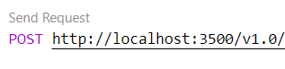

# State management demo

The purpose of this demo is to show the use of [state store components](https://docs.dapr.io/developing-applications/building-blocks/state-management/) locally and in the cloud. 

Open the _demo_statestore.code-workspace_ file and click the **Open Workspace** button in the lower right corner. This will reload your Codespace and scope your Explorer to just the folders needed for this demo.

To provision the infrastructure before the demo execute the following command in the terminal. 
This code is automatically run by the _demo.ps1_ script if the `-env` parameter is provided and it is determined that the infrastructure has not been deployed.

```
./demo.ps1 -deployOnly
``` 

The workspace consists of one top level folder _StateStore_. The _components_ folder contains components for _local_, _Azure_, _AWS_, and _GCP_. These folders allow you to show the difference between that default components (local) and the components in the other folders. The point to make comparing the files is that as long as the name of the component does not change the code will work no matter what backing service is used. 

The core of the demo is in the _sampleRequests.http_ file. At the top of the file are _demo.ps1_ commands for running the requests against local and cloud resources. Copy the desired command and run it in the terminal. This will start Dapr pointing to the appropriate components for the demo. The Dapr run command issued is output if you want to explain during the demo.

Running local
```
./demo.ps1
```

Running in Azure
```
./demo.ps1 -env azure
```

Running in AWS
```
./demo.ps1 -env aws
```

Running in GCP
```
./demo.ps1 -env gcp
```

Click the Send Request button above each of the requests to execute them. 

 

When running locally against Redis you can use the Redis Visual Studio Code extension installed in the Codespace to see the state being stored there. 

When you are done with the demo you can clean up the cloud resources by running the _cleanUp.ps1_ script using the following commands: 

```
./cleanUp.ps1
```